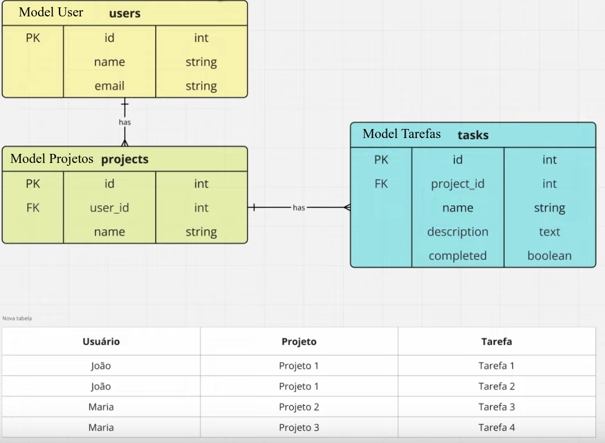

# Filamen Brasil - Tutorial
## Requisitos
- Filament 3.2
- PHP 8.3
- Laravel 11
## Instalação
```sh
composer require filament/filament:"^3.2" -W
php artisan filament:install --panels
php artisan migrate
php artisan make:filament-user # user: admin@admin.com password: 123456
php artisan serve
```
## Resource de Usuarios
```sh
php artisan make:filament-resource User --generate
```
## Crar seeder
```sh
php artisan make:seeder UserSeeder
php artisan db:seed
```
## Relacionamento HasManyThrough no Filament
- [Relacionamento HasManyThrough no Filament](https://youtu.be/_asXcJsQrFU?si=9q3ByZ5VRGbbvvvN)
* 
## Descrição
- 3 model: User, Projetos e Tarefas
- Um usuário poderá ter um ou mais projetos (relacionamento has)
- Um projeto poderá ter uma ou mais tarefas (relacionamento has)
- Cada tarefa pertence a um projeto
- Exemplo: 
  - João: projeto 1 e tarefas 1 e 2
  - Maria: projeto 2 com tarefa 3, projeto 3 com tarefa 4
## Estrutura da Tabelas
- users
  - id, name, email
- projects
  - id, user_id, name
- tasks
  - id
  - project_id
  - name
  - description
  - completed
## Cadastros
- Cadastrar primeiro os usuários, depois os projetos e por ultimo as tarefas
# Criar estrutura para Projetos e Tarefas
```sh
php artisan make:model Project -m
php artisan make:model Task -m
#